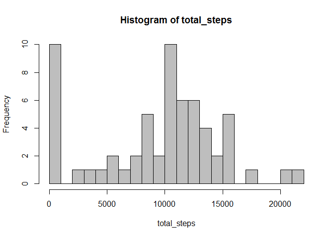
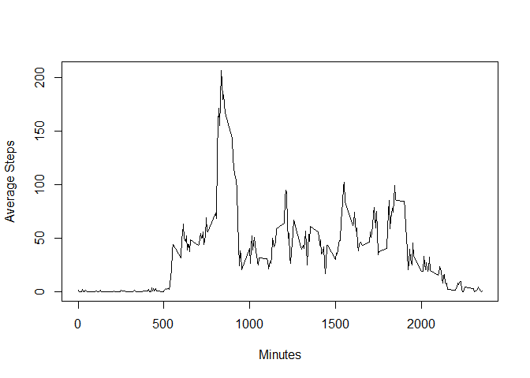
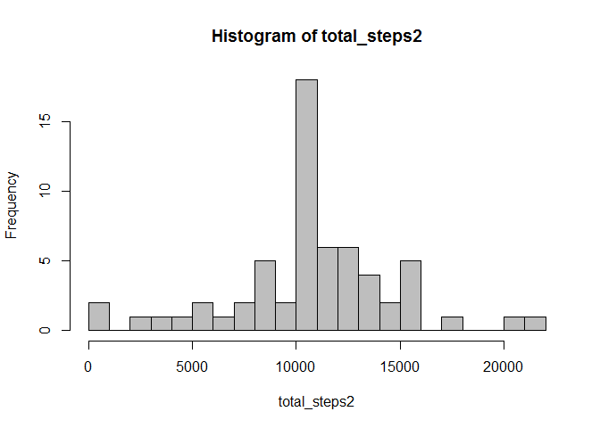
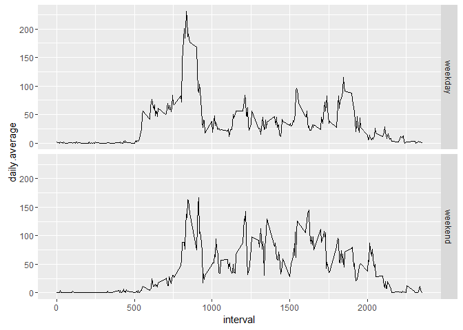

# Reproducible Research: Peer Assessment 1


## Loading and preprocessing the data
First we will load in the activity data and do any necessary preprocessing so that it is ready for analysis.


```r
activity <- read.csv("activity.csv")
head(activity)
```

```
##   steps       date interval
## 1    NA 2012-10-01        0
## 2    NA 2012-10-01        5
## 3    NA 2012-10-01       10
## 4    NA 2012-10-01       15
## 5    NA 2012-10-01       20
## 6    NA 2012-10-01       25
```

```r
str(activity)
```

```
## 'data.frame':	17568 obs. of  3 variables:
##  $ steps   : int  NA NA NA NA NA NA NA NA NA NA ...
##  $ date    : Factor w/ 61 levels "2012-10-01","2012-10-02",..: 1 1 1 1 1 1 1 1 1 1 ...
##  $ interval: int  0 5 10 15 20 25 30 35 40 45 ...
```

We see that the data is already in a tidy format. There are missing values but we will fix those later.
However, notice that the date column was read in as Factors, but for plotting purposes later on, we would like them to be in the Date format.
So here we simply convert them into date objects.


```r
activity$date <- as.Date(as.character(activity$date), "%Y-%m-%d")
str(activity)
```

```
## 'data.frame':	17568 obs. of  3 variables:
##  $ steps   : int  NA NA NA NA NA NA NA NA NA NA ...
##  $ date    : Date, format: "2012-10-01" "2012-10-01" ...
##  $ interval: int  0 5 10 15 20 25 30 35 40 45 ...
```

## What is mean total number of steps taken per day?
To answer this question we simply calculate the total number of steps taken each day and take the mean, ignoring NA values for now.

```r
total_steps <- tapply(activity$steps, activity$date, sum, na.rm = TRUE)
hist(total_steps, col = "gray", breaks = 30)
```

<!-- -->

From this histogram we see that the median lies a little over 10,000 steps a day, so we would expect the mean to be in some
neighborhood around that value as well.


```r
mean(total_steps)
```

```
## [1] 9354.23
```

```r
median(total_steps)
```

```
## [1] 10395
```


## What is the average daily activity pattern?
To get a better idea of a person's average activity each day, we will calculate the average number of steps taken for each 5 minute interval
across all days in the dataset.


```r
average_steps <- tapply(activity$steps, as.factor(activity$interval), mean, na.rm = TRUE)
with(activity, plot(unique(interval), average_steps, type = 'l', xlab = "Minutes", ylab = "Average Steps"))
```

<!-- -->

We can estimate from this plot that the 5 minute interval, on average across all days, which contains the maximum number of steps, is about 800.
However, if we want to know exactly which interval it is, we can calculate the index of the maximum value in our vector of average steps and index our vector of intervals by that number.


```r
max_index <- match(max(average_steps), average_steps)
unique(activity$interval)[max_index]
```

```
## [1] 835
```

## Imputing missing values

When we first looked at the dataset there were missing values present in the steps column.


```r
sum(is.na(activity$steps))
```

```
## [1] 2304
```
In total, there are 2304 missing values, which is not a significant portion considering there are roughly 17000 total observations in our dataset. Because of this we can devise a strategy to replace the missing values with reasonable estimates so that our data will be complete.
Since we previously calculated the average steps taken at each 5-minute interval across all days, we can just use that to create a new dataset with the missing data filled in with these averages.

```r
# make copy of original column
new_steps <- activity$steps 

# iterate through new column and replace and NA values with average for coressponding interval
for (i in 1:length(new_steps)) {
    if (is.na(new_steps[i])) {
        new_steps[i] <- average_steps[[as.character(activity$interval[i])]]
    }
}

# create new dataset
activity2 <- data.frame(new_steps, activity$date, activity$interval)

#fix column names
colnames(activity2) <- c("steps", "date", "interval")

head(activity2)
```

```
##       steps       date interval
## 1 1.7169811 2012-10-01        0
## 2 0.3396226 2012-10-01        5
## 3 0.1320755 2012-10-01       10
## 4 0.1509434 2012-10-01       15
## 5 0.0754717 2012-10-01       20
## 6 2.0943396 2012-10-01       25
```

Now with our new dataset let's look at the mean and median of the total number of steps taken each day and compare them to those of the
original data.


```r
total_steps2 <- tapply(activity2$steps, activity2$date, sum)
hist(total_steps2, col = "gray", breaks = 30)
```

<!-- -->

Compared to the first histogram, the step count with the highest frequency is still around 10000, but now that the missing values are accounted for, the graph shows are more even distribution of data on the tail ends of the curve. 


```r
mean(total_steps2)
```

```
## [1] 10766.19
```

```r
median(total_steps2)
```

```
## [1] 10766.19
```

The mean and median are slightly different from when they were calculated with missing values. While they are both around the same expected value according to the histogram, this time they turn out to be equal.  This is most likely due to the fact that for days where no step
data was recorded, the entire day was populated with average step data. This would cause the data to trend more heavily towards a more centralized mean and median respectively. 

## Are there differences in activity patterns between weekdays and weekends?

To answer this question we will create a new factor variable in the dataset with two levels, "weekday" and "weekend", to indicate whether a 
given date is a weekday or weekend.


```r
# convert date column from new dataset into Date objects
activity2$date <- as.Date(as.character(activity2$date))

## create a new vector and populate it with "weekend" or "weekday" 
## depending on coressponding entry in activity2$date
day <- vector(mode = "character", length = 0)
weekend <- c("Saturday", "Sunday")
for (i in 1:length(activity2$date)) {
    if (weekdays(activity2$date[i]) %in% weekend) {
        day[i] <- "weekend"
    } else {
        day[i] <- "weekday"
    }
}

activity2$day <- as.factor(day)
head(activity2)
```

```
##       steps       date interval     day
## 1 1.7169811 2012-10-01        0 weekday
## 2 0.3396226 2012-10-01        5 weekday
## 3 0.1320755 2012-10-01       10 weekday
## 4 0.1509434 2012-10-01       15 weekday
## 5 0.0754717 2012-10-01       20 weekday
## 6 2.0943396 2012-10-01       25 weekday
```

Now to compare average activity on weekends versus weekdays, we must calculate the average number
of steps taken across all intervals and across all weekdays or weekends.
To do this we will first split the data by the type of day, and then compute the daily averages within two two 
datasets. Once that's done, we can merge the two datasets back together and make a panel plot comparing the averages.


```r
# split data by type of day
w_ends <- subset(activity2, day == "weekend")
w_days <- subset(activity2, day == "weekday")

# calculate average across all days in each dataset
avg_w_day <- tapply(w_days$steps, as.factor(w_days$interval), mean)
avg_w_end <- tapply(w_ends$steps, as.factor(w_ends$interval), mean)

# append averages to each dataset as daily.average
w_ends$daily.average <- avg_w_end
w_days$daily.average <- avg_w_day

# vertically merge w_days and w_ends into new dataset
activity3 <- rbind(w_days, w_ends)

## create panel plot of the 5-minute interval (x-axis) and the average number of steps taken average across 
## all weekends and weekdays (y-axis)

# by using ggplot2 we can make good use of facet_grid() to answer this quetsion
library(ggplot2) 
p <- ggplot(activity3, aes(interval, daily.average)) + geom_line() + facet_grid(day~.)
show(p)
```

<!-- -->

From this plot we can see that the beginning and end of weekends versus weekdays show similar average activity, but there is a difference when considering the middle portion of each day.  For weekdays, the majority of activity takes place around the 800 minute interval, then tapers off for the rest of the day. 

During weekends, most activity takes place around the same interval, but it is noticeably less than weekdays. 
Additionally, the average activity throughout the day is greater than weekdays. Rather than there being a single
noticeable spike in activity, weekend activity shows more jumps in activity throughout the day that are 
more or less similar in magnitude. 

This difference could be due to the fact that on weekdays, most people have a set routine 
that involves going to work in the morning, resulting in less activity during the day if they work a desk job or have little reason to move around within the workplace. On weekends however, people have more flexibility. Their mornings are probably more relaxed, and they can choose to be more active during the day by running errands, exercising, or going out to socialize.
